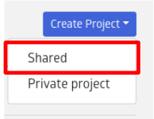
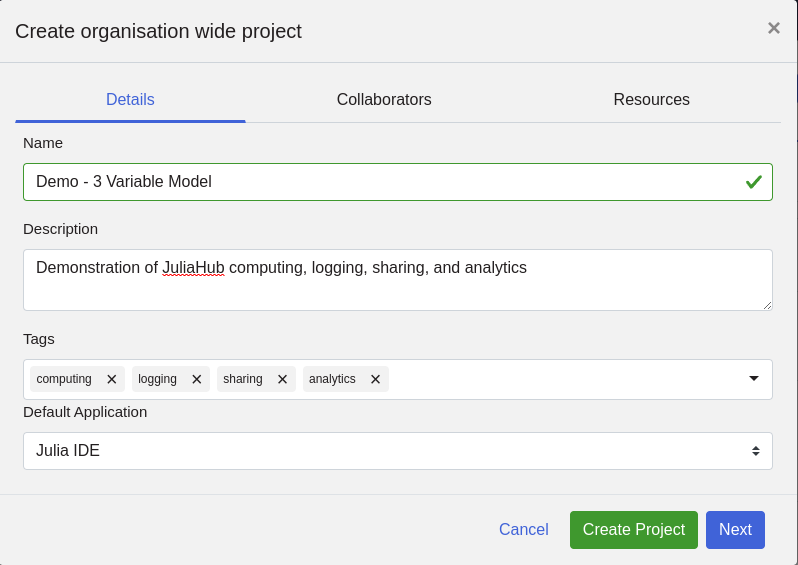
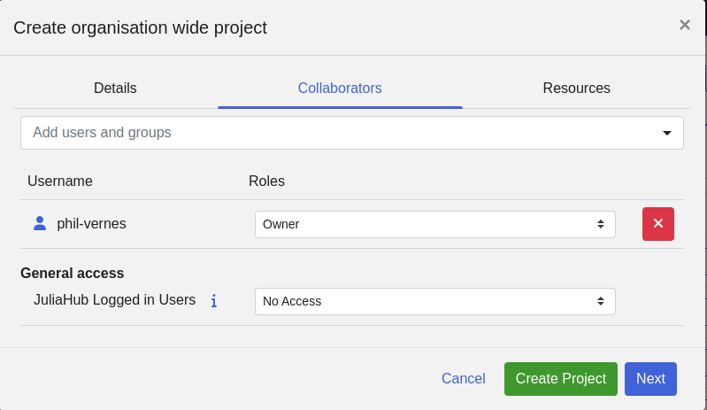
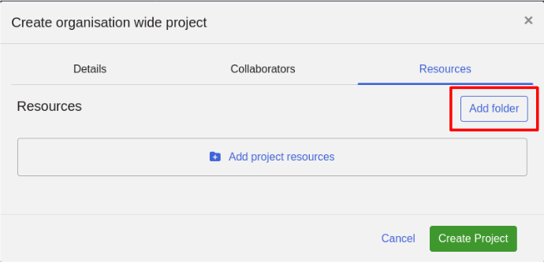
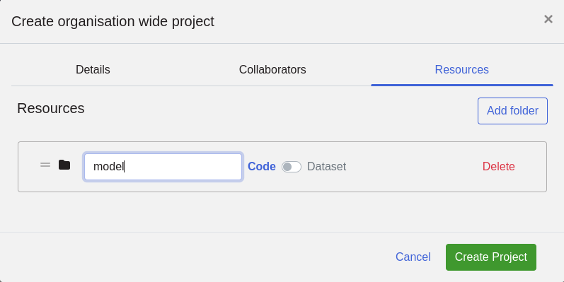
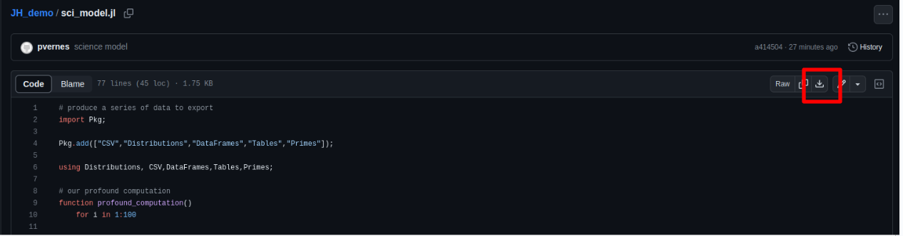
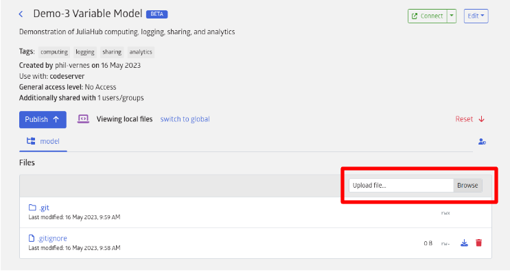
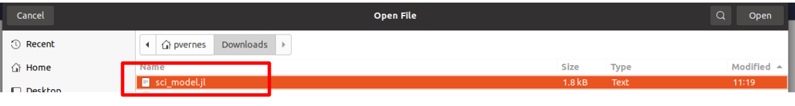
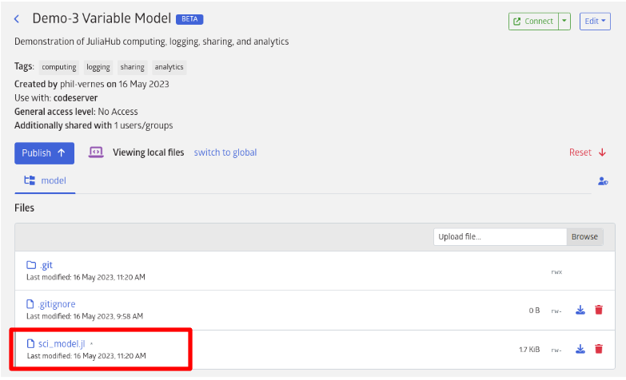

# JuliaHub Quick Start Tutorial - Part 1

Welcome to the *Quick Start* JuliaHub Tutorial!

For the purposes of this tutorial, imagine there are two users within our organization, who do the following:

1) A scientist, who writes a sophisticated program which generates a CSV output

2) An analyst, who performs various analyses on the scientist's program's CSV result 

The power of JuliaHub is its ability to enable seamless collaboration across a variety of users within an organization.  This tutorial will start with the most fundamental unit of JuliaHub:  a `Project` entity.

This tutorial consists of three parts, in order:

* Part 1:  Creating a `Project` entity in JuliaHub
* Part 2:  Executing `Project` code and logging it; Sharing a `Project`
* Part 3:  Data Analysis Within JuliaHub Using `Pluto` notebooks

# Part 1
## Objective 1 - Create a Project

To begin our tutorial, our scientist(you!) will first create a "Project". 

Projects have three components:

* Details

* Collaborators

* Resources

We will fill-in the details for each of these components, as we build our first project.

    Note:  If you are unsure how to create a project, kindly first review this documentation, below:

   [Detailed JuliaHub Project Documentation](https://help.juliahub.com/juliahub/stable/tutorials/projects/#:~:text=v%3DEmtiR21jBaA-,Creating%20a%20Project,your%20team%20find%20it%20easily)

Click on, "Create Project".  Note to select "Shared", _not_ "Private", as project sharing will be a key feature of this demonstration.

## Objective 2 - Fill-in Project Details

Name the new project, "Demo - 3 Variable Model".  Fill in the remaining fields, as shown in the picture, below.

## Objective 3 - Add a Collaborator (yourself!) to Your New Project

Then, at the top of the current modal, click "Collaborators", and find your username from within the search-and-select ("Add users and groups").

Give yourself "Owner" rights.

Set "General Access" for login users to, "No Access".  

Note:  Eventually, you will elect to share this project with the "analyst" user in our team, but this will be done, later, in the tutorial.

## Objective 4 - Add Resources (Code Folder) to Your Project

Next, in the same modal, click "Resources" in the header, and then click, "Add Folder":

A new folder will appear, with a default name - replace the folder's default name with, "model".

Finally, click "Create Project".

Note:  for this tutorial we did _not_ add any data to our project:  our code will, in fact, generate data for the project.

## Objective 5 - Download Julia Code From Github

Before adding code to our project, we must download a copy of the existing Julia code.

Navigate to the url, below, by clicking on the hyperlink:

[Github Page - Download This Code](https://github.com/pmodv/JH_demo/blob/main/sci_model.jl)

Then, in the current GitHub page, click on the download icon, indicated in the image below:

## Objective 6 - Upload Julia Code to Our JuliaHub Project

To upload the Julia code into our JuliaHub project, simply click on "Upload File" in the project's page:

... and navigate to the location of the downloaded Julia code from Objective 5:

When successfully uploaded, you should see the `sci_model.jl` in the project's `model` folder:

## Congratulations!  Your project is ready to run!

In this tutorial, you created a new `Project` entity from scratch, managed access rights, added resources, and are now ready for the next step:  executing the project code within a VS Code instance in JuliaHub.

# End of Part 1