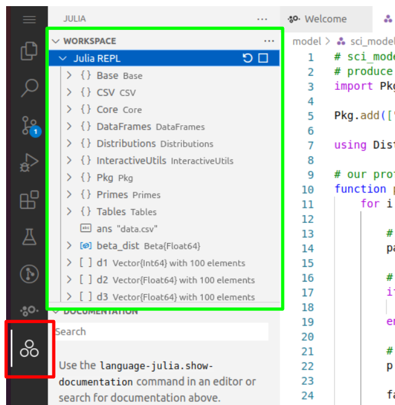
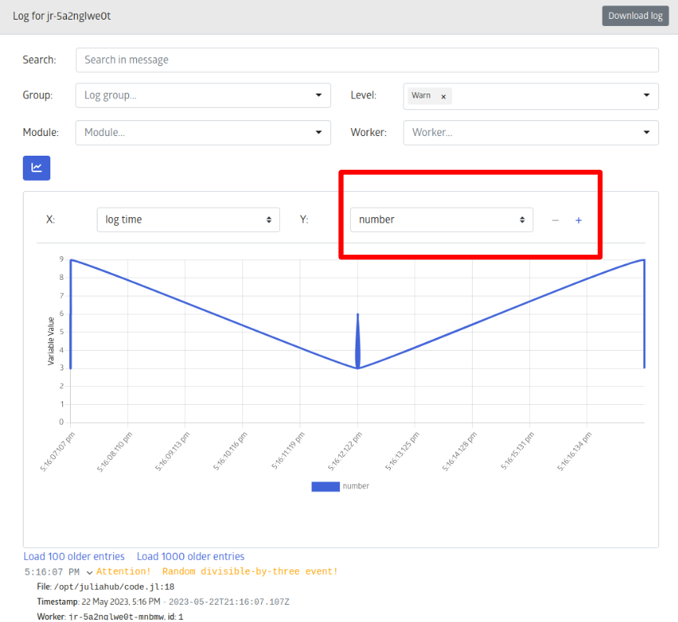

# JuliaHub Quick Start Tutorial - Part 2

Welcome to *Part 2* of the *Quick Start* JuliaHub Tutorial!

Recall, for the purposes of this tutorial, there are two users within our organization, who do the following:

1) A scientist, who writes a sophisticated program which generates a CSV output

2) An analyst, who performs various analyses on the scientist's program's CSV result 

The power of JuliaHub is its ability to enable seamless collaboration across a variety of users within an organization. 

This is the second part of our three-part tutorial:

* Part 1:  Creating a `Project` entity in JuliaHub
* Part 2:  Executing `Project` code and logging it; Sharing a `Project`
* Part 3:  Data Analysis Within JuliaHub Using `Pluto` notebooks

# Part 2

Recall from *Part 1*, we have:

* Created a new `Project` entity, which is named, `Demo - 3 Variable Model` ("the project")
* Added ourselves as `Collaborators` with `owner` rights to this project
* Downloaded `sci_model.jl` from its GitHub repo
* Added `sci_model.jl` as a `Resource` to our project

Now, we will:

* Load the `sci_model.jl` code in a JuliaHub VS Code Instance
* Execute `sci_model.jl`
* Add logging to `sci_model.jl`
* Execute `sci_model.jl`, again, and this time, observe the logging feature within JuliaHub Visual Studio
* Share the `Demo - 3 Variable Model` with our analyst colleague

## Objective 1 - Load `Project` code in JuliaHub VS Code Instance

In the `Projects` page in JuliaHub, select `Launch Julia IDE` for our `Demo - 3 Variable Model` ("the project")

Having launched the `Julia IDE`, upon its successful loading, you will see the selection change to, `Connect to Julia IDE`.  Click on this option in the dropdown menu.

The screen will briefly change to a loading page...

... and, when successfully loaded, you should see an Julia IDE that looks like this.  Recall that we named our code `Resource` folder `model`, and observe its location within the IDE, below the hash(unique id) of our instance:

Clicking on `model` within the drop-down shows us the `sci_model.jl`, our program's Julia source code file.  

## Objective 2 - Run `Project` code in JuliaHub VS Code Instance

Click on `sci_model.jl` to open the file and see the source code.  Note that only does the code load, but you now see a `Run` icon in the top-left of the IDE's editor.  Click to reveal the drop-down, showing the `Run` options for your `sci_model.jl`:

As you can see, there are three options for running `sci_model.jl`:

* Execute Active File in REPL
  
* Run File in New Process

* Debug File in New Process

We shall now go through each of these options and compare and contrast them.

## Objective 3 - Explore Running Options in the Julia IDE  

### **REPL & the Workspace**

Using a REPL is a great way to prototype code, without unnecessary logging and output code.

If you have ever used IDE's like R Studio, you are familiar already with the concept of a `workspace`, in which variables are displayed within the IDE and allow you to easily evaluate them by clicking on them, without any explicit commands to either log or output these objects.  

Likewise, executing `sci_model.jl` in REPL (read-evaluate-print-loop) enables real-time evaluation of objects within the code.  This is very helpful when experimenting and iteratively working with objects in your code, without having to explicitly log any results or interrupt the execution to see an object's value.  

When running `Execute Active File in REPL`, to observe the `workspace` of your program's objects, click on the Julia icon (it is the two circles next to each other, with another circle above them) in the IDE sidebar, highlighted by the red box.  

Then, after clicking on the Julia icon, click on `Workspace`, highlighted by the bright green.  You will now see the objects created during the execution of your program, and by clicking on each object, you may toggle viewing its value.

For example, click on `d2`, as indicated below, and then `1 ... 20` (indicates the index range of the vector - i.e. first 20 elements), and you will be able to scroll through the contents of the first 20 elements of `d2`:

*All* of these objects are available, to us, without *any* extra effort - thanks to executing our code as a `REPL`!  This simple example demonstrates the convenience and ease of executing files in `REPL` for both diagnostic and prototyping purposes.

### **REPL vs Run File in New Process**

When you `Run File in New Process`, this is the more conventional execution with which most are familiar in an IDE:  you simply run the code, with any output displayed in the `OUTPUT` window, at the bottom of your IDE.  

In contrast with `Execute Active File in REPL`, when running a file in a new process, to view a given object, the object must must either be logged or otherwise surfaced as output in the code, itself.  This means that, unlike in the `REPL`, if you intend to prototype code or perform ad-hoc diagnostics of any sort, you will need to add either logs or output to surface the desired object data.

### Overview - `Debug File in New Process`

This tutorial will not apply the `Debug File in New Process` Run option, but we will briefly cover it for sake of completeness and to orient the reader to resources that go further into depth on how to use the debugger in the Julia IDE.

Debugging proves a critical part of application development:  it enables the user to directly control the flow of the execution of the code, define observable objects, look at the call stack, and other powerful features, all in order to best observe and characterize changes in objects as code is evaluated, either incrementally or in whole.  

Unlike in the `REPL`, `Debug File in New Process` requires user input to set-up the debugger.  This includes:

* Variables - Composite variables, arrays, and dictionaries have full tree drill down support in the variables viewer
  
* Watch - The watch section allows you to enter arbitrary Julia expressions that are evaluated whenever the program pauses and the result is shown
  
* Call Stack - The call stack section allows you to look at the content of any stack frame, i.e. when you click on a different function there it will show the local variables for the selected stack frame. You can also restart code execution at any stack frame by clicking the small restart icon next to a given entry here:
  
* Breakpoints - Create and toggle activity of breakpoints
  
* Compiled Code - Add functions to be treated as **compiled code** by the debugger:  this enables much quicker performance

For more details on using the Debugger in the Julia IDE, see the link, below:

[Julia IDE Debugger - Detailed Documentation](https://www.julia-vscode.org/docs/dev/userguide/debugging/)

## Objective 4 - Logging in the Julia IDE and using JuliaHub `Jobs`

### **Logging Objects When Executing** `Run File in New Process`

Aside from simply printing data when you run your file in a new process, you can also *log* your data.  

What is the difference?  Why bother with logs, at all?

Simple: logs can be *visible to a broad audience*:  users with access rights to your project can, in fact, 

In Julia, we can log code using a variety of *macros*.  For this tutorial, we will use the `@warn` and `@info` macro (detailed [here](https://julialogging.github.io/tutorials/logging-basics/)).  

    Note: `Macros` are distinct from normal functions in Julia.  Do not be concerned if they seem unfamiliar, as advanced applications of macros are far beyond the scope of this tutorial.  However, curious readers can read the article below for an excellent tutorial on macros:
 

    
  <a href="https://jkrumbiegel.com/pages/2021-06-07-macros-for-beginners/">Julia Macros Tutorial</a>
  <!-- more links here -->

 
    
### **First Logging Macros Example:  The Contingent** `@warn` **macro in** `sci_model.jl`

In our demo code, `sci_model.jl`, we simulate a "side effect" in the `profound_computation` function by, for each iteration of its `for` loop:

* Generating a random integer between 1-10 (the code underlined in orange)
* If that random integer is divisible by 3, log the event as a *warning* (the code in the red box)

Because each iteration of the `for` loop *may* emit a log event(a log emission occurs only if the random number between 1-10 must be divisible by 3), we should not expect *every* iteration of the `for` loop to emit a log.  This will be in **contrast** with the next log we add, which **will log** on *every* iteration of the `for` loop.

### **Second Logging Macros Example:  The Default** `@info` **macro in** `sci_model.jl`

For our next log, we will log the following action:

* Generate a random number integer, between 1 and 10
* Multiply that random integer by `i`, the index of the current iteration of the `for` loop.  Call this value, `p`.
* Factor `p`.
* `collect` the factors of `p` into an iterable object (that is what `collect` does) - necessary in order to apply the `maximum` operator on the factors
* Using the `@info` macro, log:
  * Index (`i`)
  * Factors (`p`)
  * The largest factor of `p`

### **Running Our Program and Observing the Logging Output**

To observe our logs from within JuilaHub's , we need to launch our code in a specific manner:  using a *JulieHub Job*.  

From within the IDE, click your mouse over the icon highlighted inside the red box, below(if you hover over this icon, "JuliaHub" will display in a modal).

This opens a `job` modal, in which we can define the parameters of our *JuliaHub Job*, such as:

* Computing resources (number of CPU's & memory) 
* Time limit for the process in which it can finish executing
* Single or Parallel Process Execution
* Specific input parameters for a given job
* Customized dependencies

All `jobs` executed within JuliaHub will generate a `log`.   

You can access the `logs` created by your jobs from within the IDE, by clicking on the `logs` icon under the `Jobs` tab of the IDE:

... or the landing page, in JuliaHub,

... or directly from the drop-down menu, by first clicking, `Compute`, then `Job List`:

### Using the JuliaHub Logs

Recall that we defined two types of logs in our `sci_model.jl` program:

* `warn` logs ("warn" level logs)
* `info` logs ("info" level logs)

The default view of the `logs` for this `job` will show a *lot* of information, much of which pertains to mundane operations such as registries, packages, etc.

To get more meaningful logging data, below are the logs when selecting *only* `Warn`-level logs:

Note how *no* other logs appear - **except** those qualified as a `Warn`-level log, either by us within our program or by JuliaHub, itself.

Likewise, we can filter by the `Info`-level logs, too, but note that because **so many** log entries are considered of `Info`-level, we have to **scroll down** to see the desired `Info`-level logs, which we coded into `sci_model.jl`:

## Objective 5 - Plotting Logged Data

If our logs contain numerical data, we can **plot** it, directly within the the logger.

To start, unselect `Info` level and select the `Warn` level, within logging modal. 

Then, open the plotting modal, by clicking on the button highlighted in the red box, below:

Next, select the `number` variable number from the drop-down highlighted within the red box, below.  

You now have plotted your first logging data!  This can prove quite useful for diagnostics and performance analyses.

## Objective 6 - Sharing The `Demo - 3 Variable Model` Project With Our **Analyst**

This tutorial has focused, up until now, strictly on *one* persona:  the **developer** who wrote the `sci_model.jl` code in the `Demo - 3 Variable Model` project.

With the code having executed and its result logged and verified to be satisfactory, we will now *hand_off* the project to another *persona*, an **analyst**, who will use the results of the program to produce a statistical analysis of the data generated by the `sci_model.jl` program.

We thus conclude *Part 2* of the tutorial with the last step of the **developer** persona:  giving *access rights* to the `Demo - 3 Variable Model` project to the **analyst**.

*** Open `Demo - 3 Variable Model` within `Projects` modal in JuliaHub

Upon opening the project, `Demo - 3 Variable Model`, you will then select the **Sharing** icon, as highlighted, below:

Clicking on the **Sharing** icon will then open the **Sharing modal**, which we saw, previously, in *Part 1*.  

### Organizations, Users, and Sharing Resources ###

We want to *give a user* access to our project.  

Fine.

BUT - there is a BUT - the *user* to be added must come from your specific JuliaHub **Organization** - this means we can only see users within our organization, and thus, we can only *add* users from our organization.

    Note:  If you try to find a user *who is not* part of your organization, you will not succeed - only users within your organization will be accessible from the search field of the sharing modal.

In the highlighted red boxes, you can see I am searching for `mat`, as in the name, `Matt`, within the JuliaHub organization, and `mbauman` appears as an option. I select `Matt Bauman` and set his access rights to `Viewer`, enabling him to see and use the `Demo - 3 Variable Model` project but not **change it**.

In the highlighted green box, I set `No Access` for this project for the rest of the JuliaHub organization members.  This means that NO ONE else within my organization can even *view* the `Demo - 3 Variable Model` project, let alone run it.

### Success - and now, for a new *persona*: the **Analyst** ###

Having successfully shared the `Demo - 3 Variable Model` project with our analyst colleague, we are ready for *Part 3* of this tutorial, where will see how an analyst would use JuliaHub to execute code and derive insight from data generated by his colleague's code.

