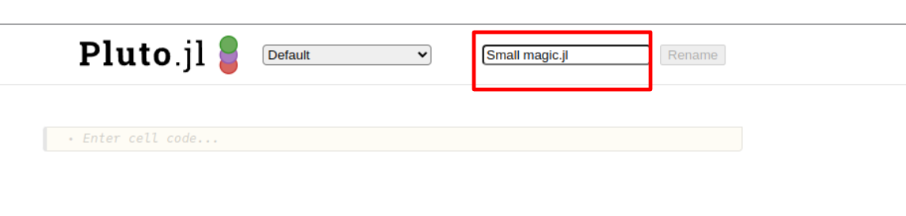

# JuliaHub Quick Start Tutorial - Part 3

Welcome to *Part 3* of the *Quick Start* JuliaHub Tutorial!

Recall, for the purposes of this tutorial, imagine there are two users within our organization, who do the following:

1) A scientist, who writes a sophisticated program which generates a CSV output

2) An analyst, who performs various analyses on the scientist's program's CSV result 

The power of JuliaHub is its ability to enable seamless collaboration across a variety of users within an organization. 

This is the third part of our three-part tutorial:

* Part 1:  Creating a `Project` entity in JuliaHub
* Part 2:  Executing `Project` code and logging it; Sharing a `Project`
* Part 3:  Data Analysis Within JuliaHub Using `Pluto` notebooks

# Part 3

In this last part of the tutorial, we will:

* Access the project created in the prior two projects
* Connect to a `Pluto` instance
* Create a `Pluto notebook`
* Analyze the CSV-file data attached to the project
* Share results
  

## Objective 1 - Load Pluto ##

Recall in `Part 2`, we *shared* our project, `Demo - 3 Variable Model` with our analyst colleague(in our case, `Matt`), and we gave him `View` access rights to the project:  he is not expected to need to edit the code or even *run* the code - simply evaluate its output - the dataset. 

While `Pluto` may appear on your landing page, if it does not, click on the highlighted red rectangle `more...`:

... to bring up a new page, in which you can then select to open, `Pluto`.  Click on `Launch`, within the highlighted red rectangle:

If you notice, there will *briefly* appear a green modal in the top-right of your screen, in which you can click `Connect` to go to `Pluto`:

If, however, this modal disappears or you do not want to naviage this way, note that opening a `Pluto` notebook is considered an instance of a `Job`, and so you may navigate to the `Jobs` page, and connect there, as well, to your `Pluto` instance:

... and from within the list of `jobs`, choose to connect to your `Pluto` instance:

Congratulations!  You have connected to your first `Pluto` instance.  You should see this page, now:

... and once it loads, you will be in your `Pluto` instance:

Click on the, `Default (private)`, option for `Create a new notebook`:

## Objective 2 - Create Pluto Workbook and load `Project` data ##

First, we will change the name of our notebook.  In the highlight region below...

... enter the notebook name, `Part_3_Workbook.jl`,

... and then click `Rename`, directly to the right of it:

